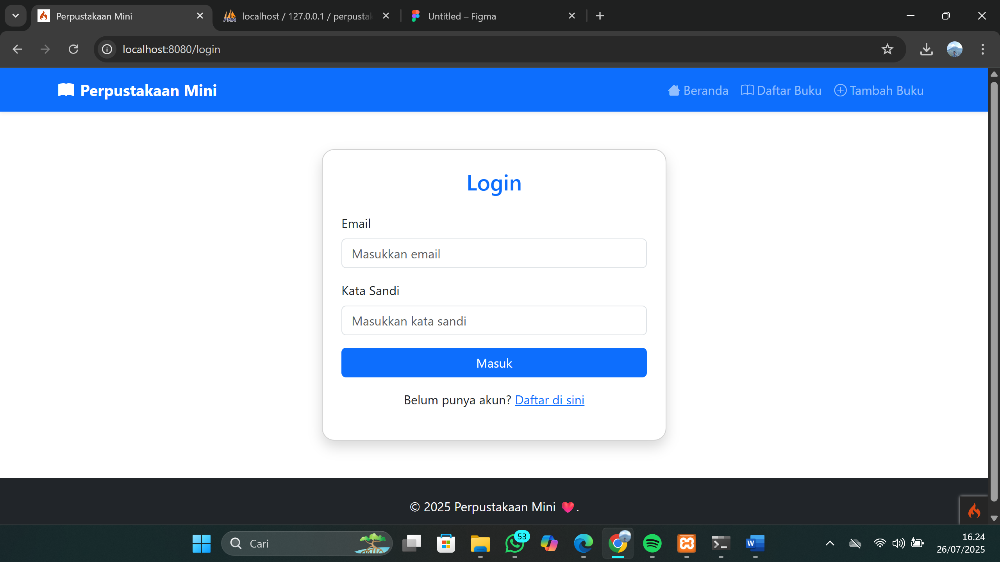
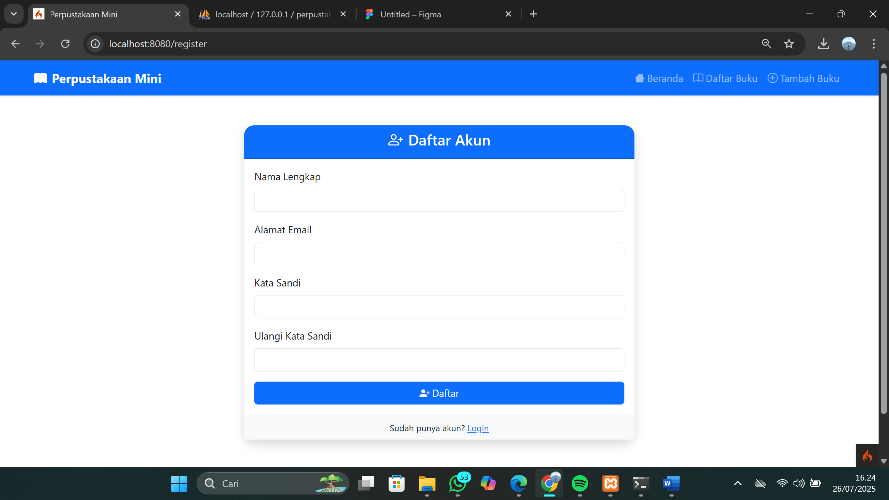
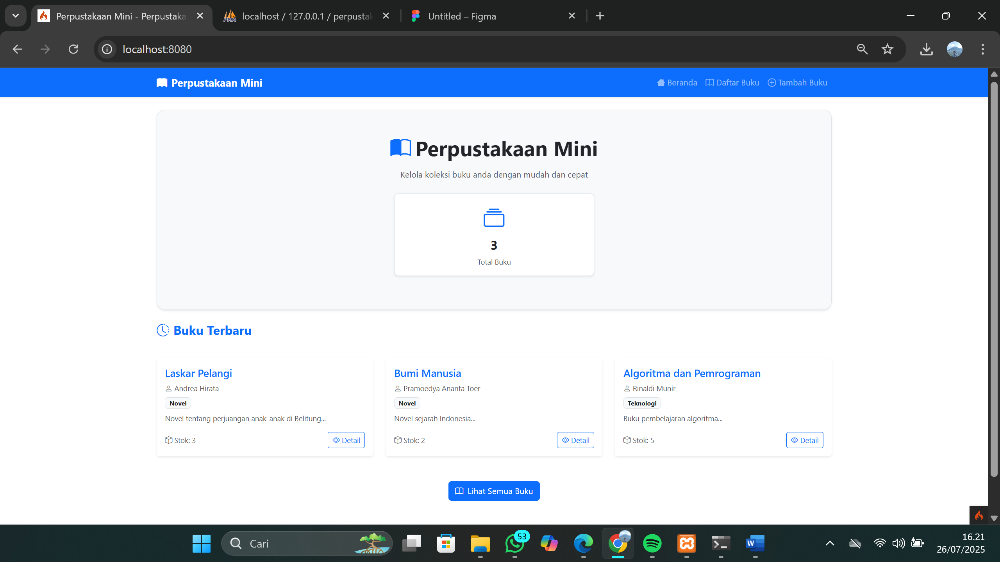
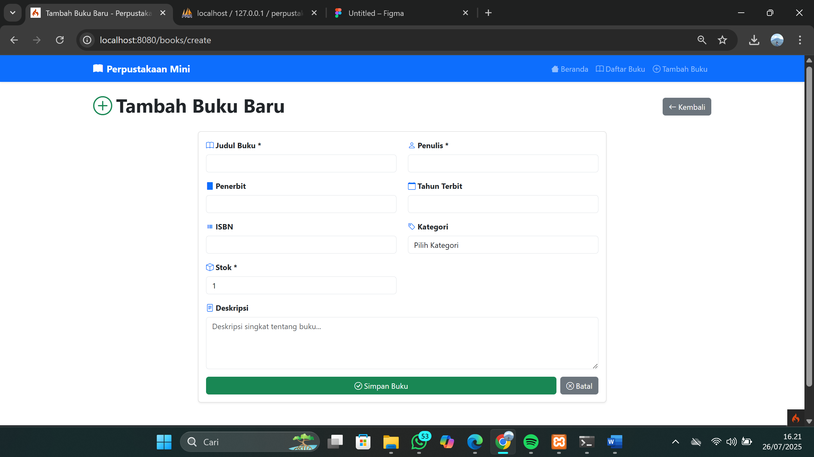
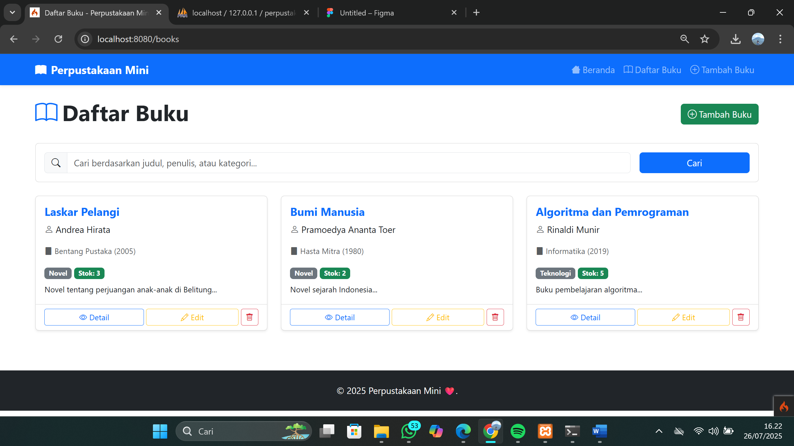

# $${\color{lightgreen}PerpustakaanMini}$$

PerpustakaanMini adalah Perpustakaan Management System berbasis web yang dikembangkan menggunakan PHP, MySQL, JavaScript, CSS, dan framework Bootstrap, dirancang untuk membantu mengelola buku yang di miliki secara efisien dengan fitur: autentikasi (login), tambah buku (CRUD dengan database MySQL), daftar buku.

| Mata Kuliah     | Dosen Pengampu                     |
| --------- | ----------------------------- |
| **Pemrograman Web 2** | Agung Nugroho S.kom., M.Kom.      |

<br>

| Profile     | Anggota                     |
| --------- | ----------------------------- |
| **312310610** | Raul Putra Widodo         |
| **312310697** | Lintang Rafi Adhi         |
| **312310591** | Wishnu Aqbil Ramadani     |

## ⚙️ Teknologi & Tools

- **Bahasa**: PHP (Native)
- **Database**: MySQL
- **Frontend**: HTML, CSS, Bootstrap
- **Email**: PHPMailer
- **Server Lokal**: XAMPP (Apache & MySQL)

---

````markdown
## 🛠️ Cara Instalasi

1. **Clone atau Unduh Project**
   ```bash
   git clone https://github.com/RaulPutraWidodo/PerpustakaanMini.git
````

2. **Letakkan Folder di XAMPP**
   Pindahkan folder hasil clone ke:

   ```
   C:\xampp\htdocs\perpustakaanmini
   ```

3. **Import Database**

   * Jalankan XAMPP dan buka `phpMyAdmin`
   * Buat database baru, misalnya: `perpustakaan_mini`
   * Import file SQL dari folder `DATABASE FILE/`

4. **Sesuaikan Koneksi Database**

   * Edit file koneksi di `includes/config.php` (atau sesuai struktur file kamu)
   * Contoh:

     ```php
     $host = "localhost";
     $user = "root";
     $pass = "";
     $dbname = "perpustakaan_mini";
     ```

5. **Jalankan xampp dan start Apache dan MySQL**
 
7. **Buka CMD dan letakkan ke folder**
 ```cd C:\xampp\htdocs\perpustakaanmini```
lalu jalankan perintah
```php spark serve```
 
10. **Jalankan Aplikasi di Browser**
   Akses melalui URL:

   ```
   http://localhost/8080
   ```

---

---

## 📸 Screenshot Tampilan

### 1. Halaman Login

Form untuk user melakukan login ke sistem.

### 2. Halaman Register

Tampilan register untuk membuat akun

### 3. Halaman Beranda

Tampilan awal Halaman Beranda setelah melakukan login

### 4. Halaman Tambah Buku

Halaman untuk menambah buku baru

### 5. Halaman Daftar Buku

Halaman untuk menampilkan daftar buku


---
